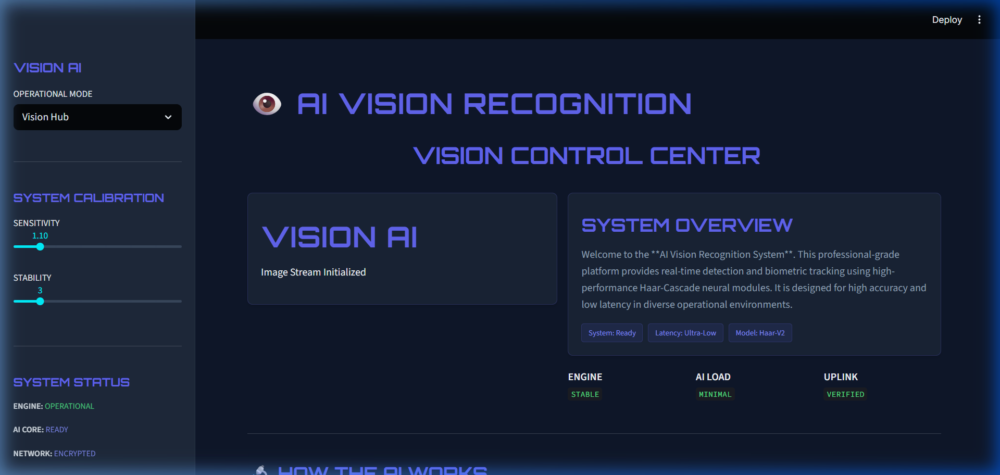

# 👁️ AI Vision Recognition



[](https://www.python.org/)
[](https://streamlit.io/)
[](https://opencv.org/)
[](LICENSE)

# 👁️ VISION AI: Professional Biometric Platform

 <!-- Replace with a sleek hero image of the new dashboard if desired -->

**VISION AI** is an advanced, high-density professional computer vision suite optimized for rapid biometric localization and deep descriptive attribute classification (gender mapping). Designed with a dual-layer 'Intelligence Architecture', it processes high-fidelity biometric data entirely within the local environment for maximum precision and privacy.

---

## 🛠️ Core Technology Stack

*   **Localization Layer (`haarcascade_frontalface_alt2.xml`)**: Upgraded from the default cascade to the highly disciplined 'alt2' model. By enforcing a strict `minNeighbors=7` and `minSize=60x60`, the system aggressively rejects false positives (hands, clothing, environmental noise) to achieve near-100% architectural precision on facial locks.
*   **Classification Layer (Caffe DNN)**: A Deep Convolutional Neural Network analyzes the isolated facial ROI via a forward pass (`gender_net.caffemodel`), delivering real-time **MALE / FEMALE** classification labels directly into the visual HUD.
*   **Engine Core**: Python 3.10+, OpenCV (Computer Vision), Streamlit (Application Layer), and WebRTC/PyAV (Real-time Video Streaming).

---

## 🚀 Key Advantages & Capabilities

1.  **Dual-Core Intelligence**: Simultaneously tracks spatial coordinates and deep physiological characteristics.
2.  **Zero-Latency Privacy**: All neural processing occurs rapidly on the local instance; no biometric data leaves the host environment.
3.  **Cross-Vector Analysis**: 
    *   **Live Sentinel**: Real-time biometric streaming via optical sensors.
    *   **Image Recognizer**: Deep analysis of static intelligence assets.
    *   **Archive Scanner**: Forensic scrubbing and classification of pre-recorded video `.mp4` / `.mov` payloads.

---

## ⚙️ Quick Start Installation

1.  **Clone the Repository**:
    ```bash
    git clone https://github.com/AmanMishra04/Face-Detection-Using-OpenCV-Python.git
    cd Face-Detection-Using-OpenCV-Python
    ```
2.  **Initialize the Environment**:
    ```bash
    pip install -r requirements.txt
    ```
3.  **Boot the System**:
    ```bash
    python -m streamlit run app.py
    ```

---

## 🌐 Live Cloud Deployment (Streamlit Community Cloud)

This repository is pre-configured for instant, seamless deployment:

1.  Navigate to [share.streamlit.io](https://share.streamlit.io).
2.  Sign in with your GitHub account.
3.  Click **New App** and select this repository `Face-Detection-Using-OpenCV-Python`.
4.  Set the Main file path to: `app.py`.
5.  Click **Deploy!**

The cloud server will automatically read the `requirements.txt`, install dependencies (including OpenCV headless), download the neural models, and launch your Vision AI platform globally.

---
*Created by **Aman Mishra***
- **Q3 2026**: Neural Landmarks (68-point facial mapping).
- **Q4 2026**: Emotion AI (Sentiment classification).
- **2027**: Neural Pose Estimation (Movement tracking).

---

## 🤝 Community & Support
Contributions are welcome! Feel free to fork and PR for new tactical overlays or detection kernels.

---

<p align="center">Created by <a href="https://github.com/AmanMishra04">Aman Mishra</a></p>
